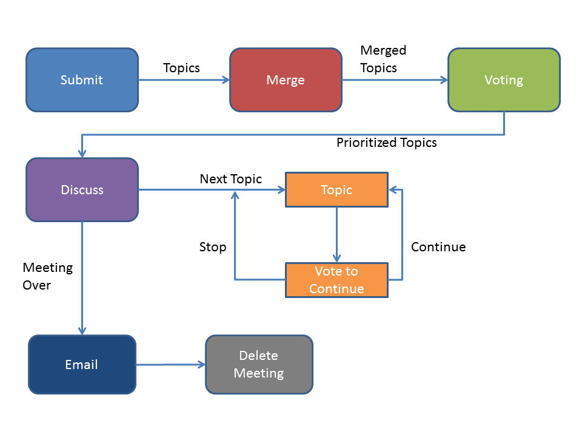

# Meeting Phases

## Global Actions

* In all cases the host can perform the same actions as the user

### User Actions

* Become host

### Host Actions

* Move meeting to next phase

## Submit

During the submit phase participants are submitting the topics that will be discussed during the meeting.

### User Actions

* Submit a topic
* View all topics

### Host Actions

* Adjust timer

## Merge

The merge phase is reponsible for going through each topic and combining similar topics.

### User Actions

* (maybe?) Merge

### Host Actions

* Definitely merge

## Voting

The voting phase allows the participants to vote on each topic.

### User Actions

* Ability to vote
* Ability to vote up to 3 times
* Ability to vote on several topics
* Ability to use all 3 votes on a single topic

### Host Actions

* No special host actions

## Discuss

### User Actions

* Vote to continue talking about the topic (continue/stop)
* (maybe?) Take notes
* (maybe?) Opt in for email

### Host Actions

* Advance to next topic
* (maybe?) Adjust timer

## Diagram

